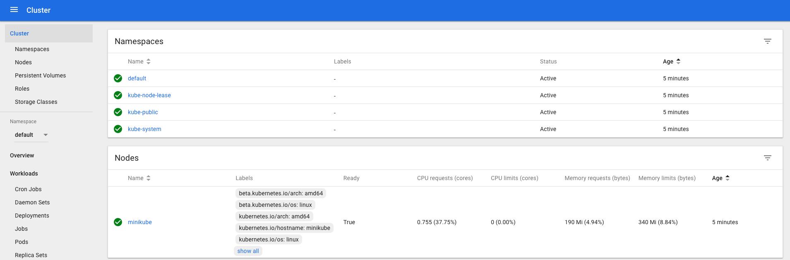

# Minkube Demo

> You don't have to type `$`. `$` signifies command prompt.

You start by creating a local cluster

```
$ minikube start -p myMiniKube
```

It takes a few minute to create a local cluster.

We can check status of our cluster using the below mentioned command.

```
$ minikube -p myMiniKube status
```

```
host: Running
kubelet: Running
apiserver: Running
kubectl: Correctly Configured: pointing to minikube-vm at 192.168.99.112
```

We can get IP address of our Minikube instance by running following command.

```
$ minikube -p myMiniKube ip
192.168.99.112
```

To view the dashboard we can use following command.

```
$ minikube -p myMiniKube dashboard
```



## Check context of kubectl

```
$ kubectl config current-context
```

## SSH into minikube VM

```
$ minikube -p myMiniKube ssh
```

Now, you can run any command

```
free -h
df -h
exit
```

